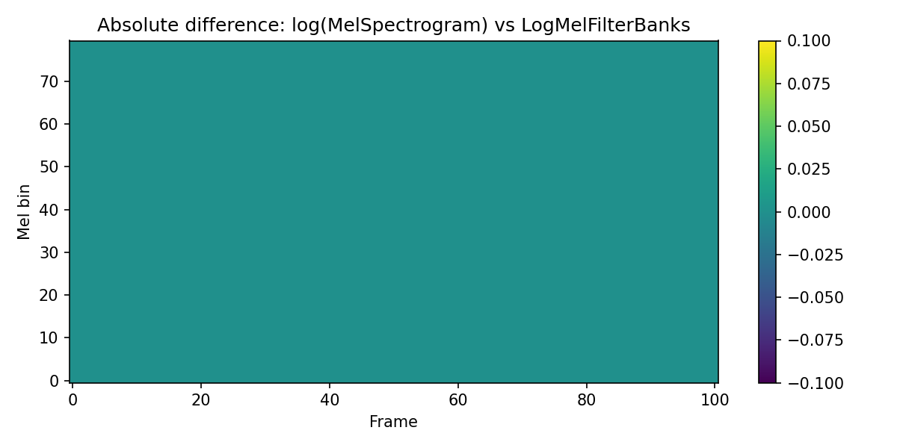
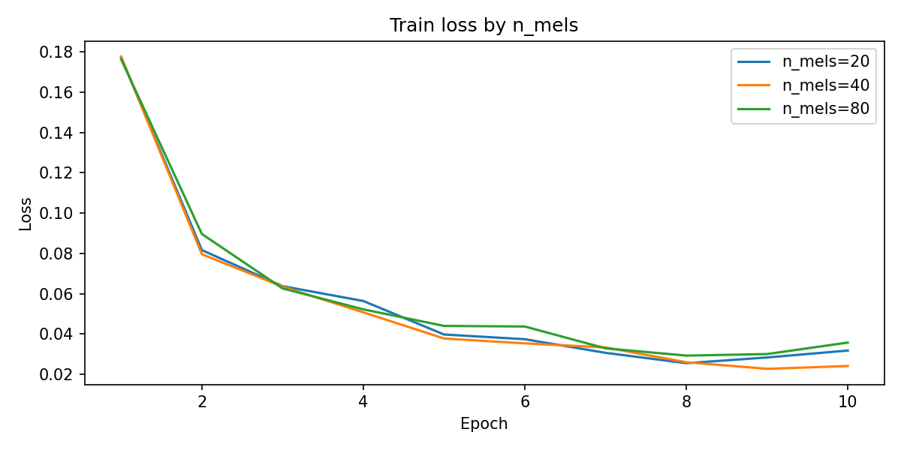
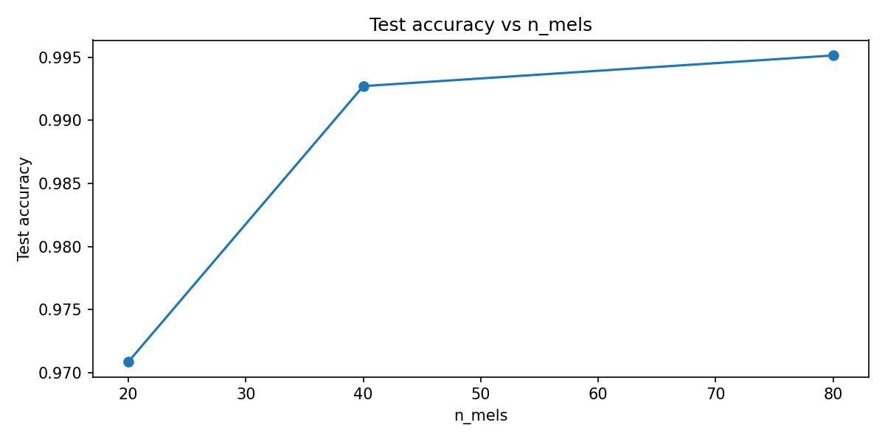
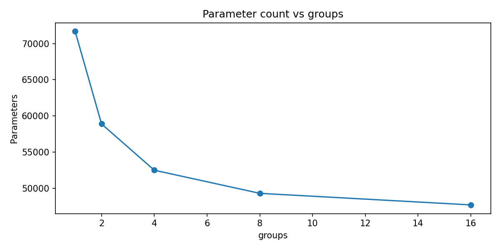
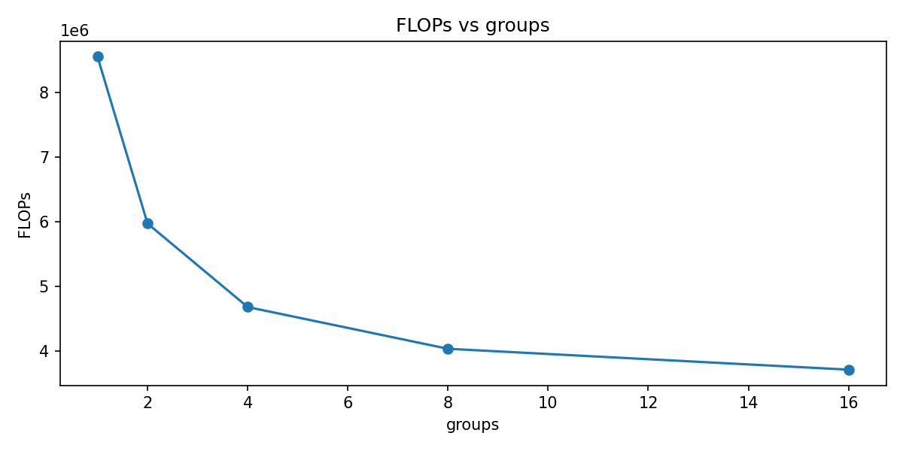
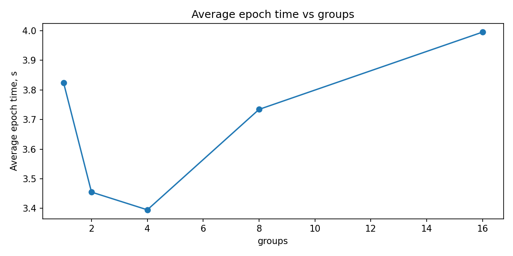

# Assignment 1 — LogMelFilterBanks and Conv1d keyword classification

## 1. Цель работы

Целью работы было:
1. реализовать слой `LogMelFilterBanks`, эквивалентный `torch.log(torchaudio.transforms.MelSpectrogram(...)+1e-6)`;
2. обучить небольшую `Conv1d`-модель для бинарной классификации команд `yes/no` на датасете `SpeechCommands`;
3. исследовать влияние числа mel-фильтров `n_mels` на качество и вычислительную стоимость модели;
4. исследовать влияние параметра `groups` в `Conv1d` на качество и эффективность модели.

---

## 2. Реализация LogMelFilterBanks

Слой `LogMelFilterBanks` был реализован на основе:
- `torch.stft` для вычисления спектра;
- возведения модуля STFT в степень `power=2.0` для получения power spectrogram;
- `torchaudio.functional.melscale_fbanks` для применения mel-фильтров;
- логарифмирования результата: `torch.log(mel + 1e-6)`.

Реализация возвращает тензор формы `(batch, n_mels, n_frames)`.

### Проверка корректности

Корректность реализации проверялась сравнением с эталонной реализацией:

```python
torch.log(
    torchaudio.transforms.MelSpectrogram(...)(signal) + 1e-6
)
```

Результаты проверки:
- `ref shape: (1, 80, 101)`
- `ours shape: (1, 80, 101)`
- `max abs diff: 0.0`
- `allclose(atol=1e-5): True`

Таким образом, реализованный слой полностью совпал с эталонной реализацией.

---

## 3. Датасет и постановка задачи

В качестве датасета использовался `torchaudio.datasets.SPEECHCOMMANDS`.
Из полного набора были оставлены только два класса:
- `yes`
- `no`

Использовались стандартные разбиения:
- `training`
- `validation`
- `testing`

Поскольку аудиозаписи в датасете могут иметь немного разную длину, все примеры были приведены к фиксированной длине `16000` сэмплов:
- короткие записи дополнялись нулями;
- длинные обрезались.

Это соответствует примерно 1 секунде аудио при частоте дискретизации `16 kHz`.

---

## 4. Архитектура модели

Модель состояла из двух частей:
1. извлечение признаков с помощью `LogMelFilterBanks`;
2. классификатор на основе нескольких слоёв `Conv1d`.

Общая схема:
- `LogMelFilterBanks`
- `Conv1d + BatchNorm1d + ReLU + MaxPool1d`
- `Conv1d + BatchNorm1d + ReLU + MaxPool1d`
- `Conv1d + BatchNorm1d + ReLU`
- `AdaptiveAvgPool1d(1)`
- `Linear(128 -> 2)`

Модель была ограничена по размеру и удовлетворяла требованию иметь не более примерно `100K` параметров.

---

## 5. Эксперименты

Были проведены две серии экспериментов:
1. изменение числа mel-фильтров `n_mels`;
2. изменение числа групп `groups` в первом `Conv1d`.

### 5.1 Эксперименты с `n_mels`

Проверялись значения:
- `n_mels = 20`
- `n_mels = 40`
- `n_mels = 80`

Итоговые результаты:

| n_mels | groups | test_acc | params | FLOPs | avg_epoch_time |
|---|---:|---:|---:|---:|---:|
| 20 | 1 | 0.9709 | 52482 | 4679680 | 2.6047 s |
| 40 | 1 | 0.9927 | 58882 | 5972480 | 2.9930 s |
| 80 | 1 | 0.9951 | 71682 | 8558080 | 3.7788 s |

### Анализ результатов по `n_mels`

С увеличением числа mel-фильтров качество классификации заметно улучшалось:
- при `n_mels = 20` accuracy составила `0.9709`;
- при `n_mels = 40` accuracy выросла до `0.9927`;
- при `n_mels = 80` accuracy достигла `0.9951`.

Это ожидаемо, поскольку большее число mel-фильтров позволяет сохранить больше спектральной информации.

Однако увеличение `n_mels` приводит и к росту вычислительной стоимости:
- число параметров выросло с `52482` до `71682`;
- FLOPs выросли с `4.68M` до `8.56M`;
- среднее время эпохи выросло с `2.60 s` до `3.78 s`.

Следовательно, увеличение `n_mels` улучшает качество, но делает модель тяжелее.

---

### 5.2 Эксперименты с `groups`

Во второй серии экспериментов использовалось фиксированное значение:
- `n_mels = 80`

Проверялись значения:
- `groups = 1`
- `groups = 2`
- `groups = 4`
- `groups = 8`
- `groups = 16`

Итоговые результаты:

| n_mels | groups | test_acc | params | FLOPs | avg_epoch_time |
|---|---:|---:|---:|---:|---:|
| 80 | 1  | 0.9903 | 71682 | 8558080 | 3.8246 s |
| 80 | 2  | 0.9927 | 58882 | 5972480 | 3.4551 s |
| 80 | 4  | 0.9854 | 52482 | 4679680 | 3.3952 s |
| 80 | 8  | 0.9951 | 49282 | 4033280 | 3.7343 s |
| 80 | 16 | 0.9879 | 47682 | 3710080 | 3.9952 s |

### Анализ результатов по `groups`

Изменение числа групп в `Conv1d` влияет как на качество, так и на вычислительную эффективность модели.

При увеличении `groups` вычислительная стоимость уменьшается:
- число параметров снижается с `71682` при `groups=1` до `47682` при `groups=16`;
- FLOPs снижаются с `8.56M` до `3.71M`.

Качество при этом меняется не монотонно:
- `groups=1` → `0.9903`
- `groups=2` → `0.9927`
- `groups=4` → `0.9854`
- `groups=8` → `0.9951`
- `groups=16` → `0.9879`

Лучший результат в данном запуске был достигнут при `groups=8`, где accuracy составила `0.9951`.
При этом модель с `groups=8` имела меньше параметров и FLOPs, чем базовая модель с `groups=1`.

Это показывает, что grouped convolution может дать удачный компромисс между качеством и эффективностью.

---

## 6. Графики

В ходе экспериментов были построены следующие графики:
- `mel_difference.png` — визуальное сравнение mel-признаков;
- `train_loss_by_mels.png` — зависимость функции потерь от эпохи для разных `n_mels`;
- `test_acc_vs_mels.png` — зависимость итоговой accuracy от `n_mels`;
- `params_vs_groups.png` — число параметров в зависимости от `groups`;
- `flops_vs_groups.png` — вычислительная сложность в зависимости от `groups`;
- `epoch_time_vs_groups.png` — среднее время эпохи в зависимости от `groups`.

Ниже следует вставить соответствующие изображения из папки `figures/`.

### Сравнение mel-признаков


### Loss для разных `n_mels`


### Accuracy для разных `n_mels`


### Params vs groups


### FLOPs vs groups


### Epoch time vs groups


---

## 7. Итоговые выводы

В ходе работы был успешно реализован слой `LogMelFilterBanks`, совпадающий с `torchaudio`-реализацией по форме и значениям. Проверка показала полное совпадение, включая `max abs diff = 0.0` и `allclose=True`.

Эксперименты показали, что увеличение числа mel-фильтров `n_mels` улучшает качество классификации:
- при `n_mels=20` accuracy составила `0.9709`;
- при `n_mels=80` accuracy выросла до `0.9951`.

Однако рост `n_mels` увеличивает число параметров, FLOPs и время обучения.

Исследование параметра `groups` показало, что grouped convolution позволяет уменьшить вычислительную стоимость модели. При этом качество зависит от выбранного значения `groups` не монотонно. В данном эксперименте лучший компромисс был получен при `groups=8`, где была достигнута accuracy `0.9951` при меньшем числе параметров и FLOPs, чем у базовой модели.

### Общий вывод

Для данной задачи наиболее удачной конфигурацией оказалась модель с:
- `n_mels = 80`
- `groups = 8`

Она обеспечила максимальное качество при сравнительно невысокой вычислительной стоимости.

---

## 8. Ссылка на репозиторий

https://github.com/demokritfromabyss/speech_recognition_generation
